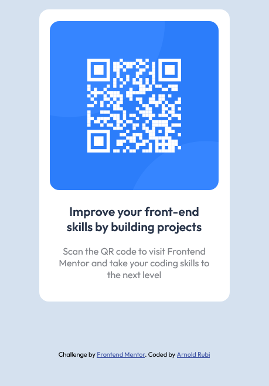

## Overview
This is a simple QR code card from Front End Mentor. I decided to take the challenge to improve my CSS skills.

### Screenshot

### Link

- Solution URL: [Add solution URL here](https://arnoldrubi.github.io/QR-Code-Repository/)

### Learning and insights

Although not required, I decided to use flexbox for this project. I haven't implemented flexbox for a while and this is a good way to practice the basics. 

## Author
Arnold Rubi 

- Website - [Arnold Rubi](https://arnoldrubi.com/)
- Frontend Mentor - [@arnoldrubi](https://www.frontendmentor.io/profile/arnoldrubi)
- Twitter - [@boygie17](https://twitter.com/boygie17)

## Acknowledgments

Thanks to Colt Steele and his amazing [Front End Developer Bootcamp](https://www.udemy.com/course/the-web-developer-bootcamp/).